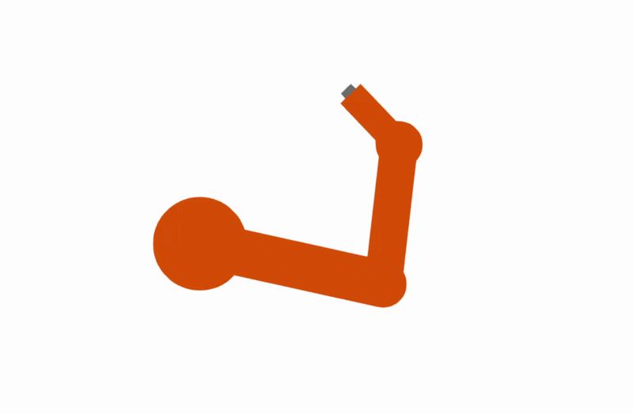
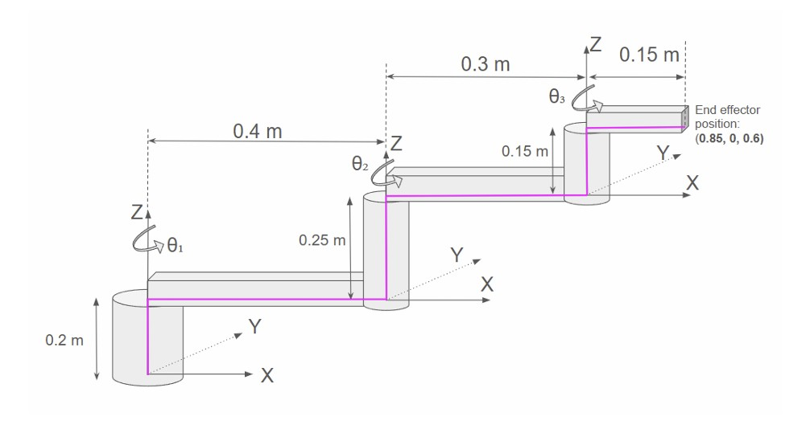
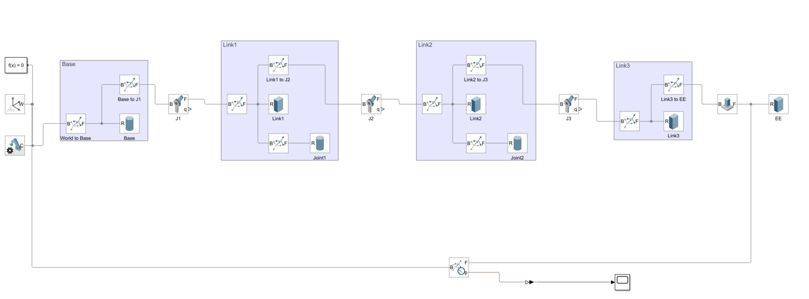
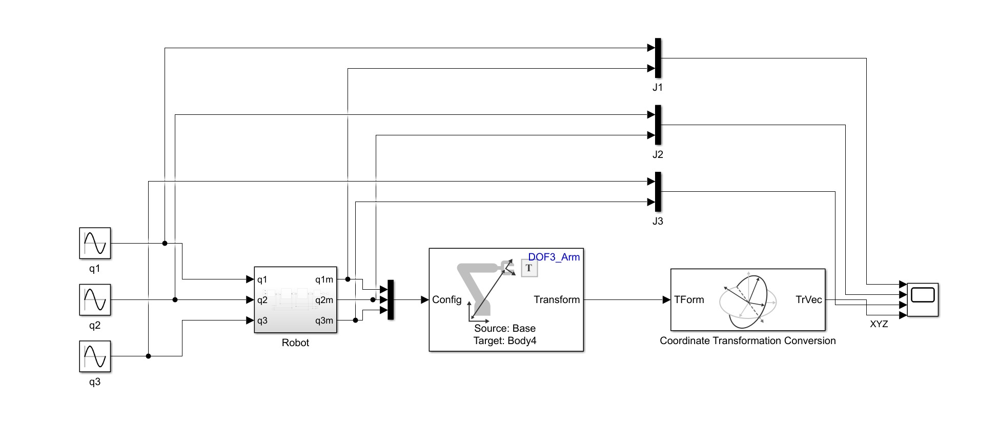

🤖 Analytical and Model-Based Kinematic Study of a SCARA Manipulator

📌 Overview  

This project analyzes the forward and inverse kinematics of a SCARA (Selective Compliance Assembly Robot Arm) using MATLAB and Simulink.

The system models the relationship between joint variables and the end-effector position, and validates the results through simulation.

---

⚙️ System Description  

The SCARA robot consists of three rotational joints with fixed vertical displacement. The kinematic model is defined using Denavit–Hartenberg (DH) parameters.

DH Parameters:
| Joint | θ (angle) | d (offset) | a (length) | α (twist) |
|------|----------|-----------|-----------|-----------|
| 1 | θ₁ | 0.2 m | 0.4 m | 0 |
| 2 | θ₂ | 0.25 m | 0.3 m | 0 |
| 3 | θ₃ | 0.15 m | 0.15 m | 0 |

---

🧮 Forward Kinematics

The end-effector position is computed using homogeneous transformation matrices:

T = A₁ · A₂ · A₃

Position Equations:
- X = 0.4 cos(θ₁) + 0.3 cos(θ₁ + θ₂) + 0.15 cos(θ₁ + θ₂ + θ₃)
- Y = 0.4 sin(θ₁) + 0.3 sin(θ₁ + θ₂) + 0.15 sin(θ₁ + θ₂ + θ₃)
- Z = 0.6 m (constant)

📌 The Z position remains constant due to the robot's structure.

---

✅ Validation

The forward kinematics equations were validated using MATLAB:

- For θ₁ = 0°, θ₂ = 0°, θ₃ = 0°:
  - X = 0.85 m
  - Y = 0 m
  - Z = 0.6 m

- For θ₁ = 10°, θ₂ = 15°, θ₃ = 20°:
  - X ≈ 0.7719 m
  - Y ≈ 0.3023 m
  - Z = 0.6 m

Results were verified using MATLAB scripts.

---

🧠 Workspace Analysis

The robot workspace is a **planar annulus** located at:

Z = 0.6 m

- Maximum reach: 0.85 m

This represents the reachable region of the end-effector in Cartesian space.

---

🖥️ Simulation (Simulink)

A Simscape Multibody model was built in Simulink to simulate the SCARA robot.

Features:
- Joint inputs (θ₁, θ₂, θ₃)
- Forward kinematics block
- Scope visualization of X, Y, Z

The simulation confirms analytical results.

---

🔄 Inverse Kinematics

Inverse kinematics was implemented to compute joint angles for a desired end-effector position.

Example Target:
(X, Y, Z) = (0.7719, 0.3023, 0.6)

The corresponding joint angles were solved using MATLAB.

---

📐 Trajectory Planning

The robot follows a square trajectory in Cartesian space:

- P₁ = (0.32, 0.32, 0.60)
- P₂ = (0.08, 0.32, 0.60)
- P₃ = (0.08, 0.08, 0.60)
- P₄ = (0.32, 0.08, 0.60)

The inverse kinematics controller drives the end-effector through these points.

---

🎥 Demo

  

The robot successfully follows a square path using inverse kinematics control.

---

🛠 Technical Implementation

This project bridges the gap between mathematical theory and physical simulation using a multi-tool approach:

 - Symbolic Math Toolbox: Used to derive the analytical Forward Kinematics (FK) and Inverse Kinematics (IK) equations.
 - MATLAB Robotics System Toolbox: Leveraged for coordinate transformations and handling homogeneous transformation matrices.
 - Simscape Multibody: Provides the physical simulation environment where the 3-DOF SCARA arm is modeled with Revolute Joints and rigid bodies to visualize movement in 3D.

---  

## 📊 Results

### Workspace

### Robot Model

### Forward Kinematics

📚 Key Concepts
- Denavit–Hartenberg (DH) modeling
- Homogeneous transformations
- Forward & inverse kinematics
- Workspace analysis
- Trajectory planning

---

🚀 How to Run

1. Prerequisites
   
    Ensure you have the following installed in MATLAB:
    Robotics System Toolbox
    Simscape & Simscape Multibody
    Symbolic Math Toolbox

2. Execution Steps

Clone & Navigate:

git clone https://github.com/Niki-89-AI/SCARA-Kinematics-Analysis.git
cd SCARA-Kinematics-Analysis

Setup Workspace:
Open MATLAB and add this folder to your path. Double-click square_trajectory.mat to load the trajectory waypoints into your workspace.

Run Kinematic Solvers:
Run HW3_FK.m to see the derived position equations in the Command Window.
Run IK_targetpos.m to verify the joint angles for a specific target.

Launch Simulation:
Open IK_System.slx. This model uses Simscape blocks to represent the physical links. Press Run to open the Mechanics Explorer and visualize the 3D robot tracing the square path.

🔗 Author

Nikoletta Biri  

Arizona State University – AI (Robotics)
